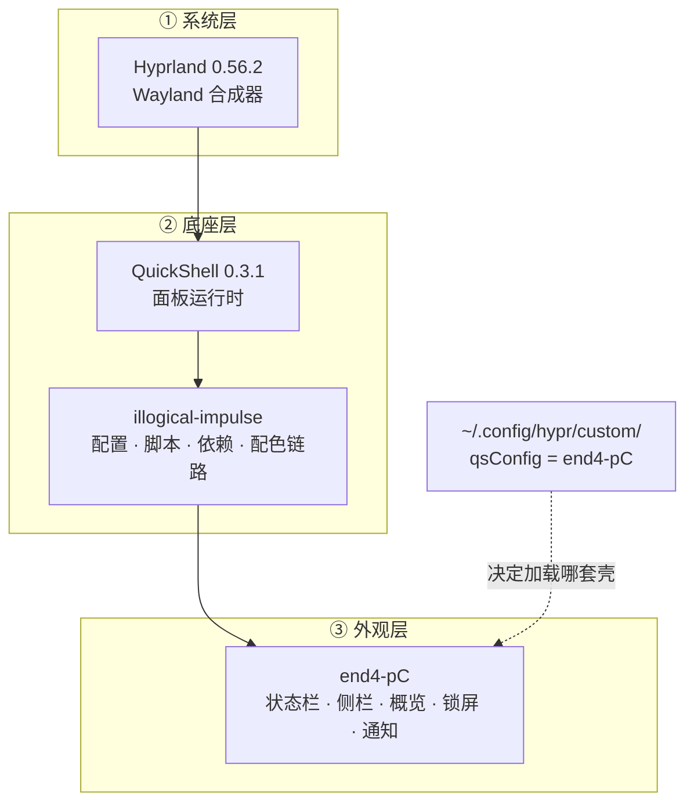

# 我把桌面壳换成了 end4-pC：一份 Arch + Hyprland 构建记录

> 我的目前桌面 = Hyprland（窗口合成器）+ QuickShell（面板运行时）+ illogical-impulse（配置/脚本/依赖/配色底座）+ end4-pC（外观壳），再配一整套外挂工具链（kitty、Thunar、fuzzel、fcitx5、grim+satty、hyprlock+hypridle、matugen 取色、greetd 登录…）

---

## 一、写在前面

我之前用的是 DMS（DankMaterialShell），好处很实在：`pacman` 一体更新，省心。

后来看到 end4-pC 的界面——在线壁纸选择器、歌词面板、桌面小组件、可自由配置的状态栏——就想换。但真动手才发现这件事没那么简单：**它不是一个能直接装的软件包，而是一整套桌面壳。**

于是就有了现在这套结构：

```text
illogical-impulse（底座） + end4-pC（外观壳）
```

底座负责配置、脚本、依赖、配色链路；外观壳负责你看到的一切。两者共用一份配置，靠一个环境变量切换。

---

## 二、桌面巡礼

先看整体：桌面全貌 + 左侧栏 + 桌面小组件都在这一屏里。


下面按「横向一条、纵向两面」的顺序，把每块拆开讲。

### 1. 顶部状态栏

| 位置 | 内容 |
|:---|:---|
| 左 | 工作区指示（1–10）、设置入口、键盘布局 |
| 中 | 天气温度、日期与时钟、正在播放的媒体（点开即媒体控制） |
| 右 | 系统托盘、音量、网络、电池、输入法状态 |

整条栏可以一键收起（`Super + J`），模块的增删排序都在设置里点选。

### 2. 左侧栏（`Super + A`）

日常使用频率最高的一栏，一列卡片从上往下：

| 卡片 | 说明 |
|:---|:---|
| 用户卡 | 头像、主机名、开机时长，带锁屏按钮 |
| 天气 | 当前温度与天气状况、城市、湿度 / 风速 / 能见度 |
| To-Do | 待办清单，可直接勾选 |
| 系统监控 | CPU / 内存 / 磁盘占用 |
| 计时器 | 番茄钟、秒表、倒计时 |
| 时钟 | 当前日期时间 + 世界时钟（广州 / 纽约 / 伦敦 / UTC） |
| 文件转换 | 把文件拖进去直接转格式 |
| AI 助手 | 见第八节 |

基本上「看天气、看时间、看负载、记待办」这几件零碎事，左边这一栏全包了。

### 3. 右侧栏（`Super + N`）

右边更像一个控制中心：

- 快捷开关：网络、蓝牙、免打扰、通知
- 音量与亮度滑块
- 系统状态检查：Wayland 环境诊断、壁纸库数量、更新状态
- 日历（可翻月）
- 通知中心：集中查看未读通知

左右两栏同时展开的样子：


### 4. 窗口概览（`Super + Tab`）

十个工作区排成网格，每格直接显示该工作区里窗口的缩略图；顶部还有一个搜索框，可以直接搜应用，也能当计算器用。


### 5. 桌面小组件

天气、时钟大表盘、系统监控、待办、计时器这些可以**直接浮在壁纸上**当组件用——不占工作区、也不影响窗口，上面几张图里都能看到它们。

### 6. Dock 与媒体控制

屏幕底部有一条 Dock 放常用应用；紧挨着的是媒体控制条，显示封面、标题与播放进度，切歌不用切窗口。

> [!NOTE]
> 整套界面的颜色是跟着壁纸走的（Material You）：换一张壁纸，状态栏、组件、窗口边框的配色会一起变。所以同一篇文章里的截图最好用同一张壁纸，不然风格会显得割裂。

---

## 三、这套桌面由什么组成

### 核心三层

| 角色 | 组件 | 版本 | 说明 |
|:---|:---|:---|:---|
| 合成器 | **Hyprland** | 0.56.2-3 | Wayland 平铺合成器，窗口管理的本体 |
| 面板框架 | **QuickShell** | 0.3.1-1 | Qt/QML 写的桌面壳运行时 |
| UI 底座 | **illogical-impulse**（ii） | `2f0c8bf4`（2026-09-14） | 配置、脚本、依赖、主题链路 |
| 外观壳 | **end4-pC** | `0ff392b`（2026-09-22） | 你看到的界面全在这 |

### 日用组件

| 用途 | 组件 |
|:---|:---|
| 终端 | kitty 0.49.1 |
| 文件管理 | Thunar 4.20.10 |
| 启动器 | fuzzel 1.15.0（壳内另有搜索面板） |
| 输入法 | fcitx5 5.1.23（中文） |
| 截图 / 标注 | grim + slurp + satty，壳内另带区域截图与录屏 |
| 剪贴板 | wl-clipboard + cliphist，接壳内剪贴板面板 |
| 锁屏 / 息屏 | hyprlock 0.9.6 + hypridle 0.1.8（实际锁屏由壳接管） |
| 取色 | hyprpicker |
| 配色生成 | matugen 4.2.0（从壁纸取色，输出到 Hyprland / GTK / Qt / 壳） |
| 通知 | QuickShell 内置通知中心 |
| 音频 | PipeWire + WirePlumber + pavucontrol-qt |
| 登录 | greetd + tuigreet |
| 字体 | Noto CJK、思源黑/宋、Nerd Fonts Symbols、Font Awesome、Bibata 光标 |
| 常用应用 | Firefox、Chromium、VS Code、WPS、GIMP、mpv、OBS Studio、btop、cava、fastfetch、Neovim、yazi |

> [!NOTE]
> 统计口径：本机 `pacman -Qqe` 显示 **222 个显式安装包**。这里面只有一小部分是桌面壳本身，其余是依赖链和日常软件——这也是为什么"手动照抄配置文件"通常装不起来，得让安装脚本去算依赖。

### 硬件与显示环境

| 项 | 值 |
|:---|:---|
| 系统 | Arch Linux（内核 7.2.7-zen1-1-zen） |
| CPU | Intel i5-12600KF |
| GPU | NVIDIA RTX 5060 Ti |
| 内存 | 62.6 GiB |
| 主屏 | DP-1 · 2560×1440 @ 120Hz · scale 1 |
| 副屏 | HDMI-A-1 · 2560×1600 @ 120Hz · 竖屏 · scale 1.6 |

---

## 四、三者的关系，一张图说清

很多人（包括我一开始）会以为 end4-pC 是"另一个桌面"，装它就能替代 ii。不是的——**它是一套壳，离开 ii 起不来。**



关键点：

- ii **装着、但不加载它的界面**——靠 `qsConfig` 这个变量，让 QuickShell 启动时去读 end4-pC 的壳。两套界面不会同时跑。
- 所以更新是**两条线**：依赖/配置跟着 ii 走，界面跟着 end4-pC 走，互不同步。这点后面"踩坑"里还会提。

---

## 五、安装：三步走

### 0. 前置

- Arch Linux（或 Arch 系发行版）
- 已配好的显卡驱动与 Wayland 环境（NVIDIA 用户建议先过一遍 Hyprland 官方 wiki）
- `git`、`base-devel`，以及 `yay` 或 `paru`
- 动手前先备份：`cp -r ~/.config/hypr ~/backups/hypr-$(date +%F)`

### 1. 装底座 illogical-impulse

```bash
git clone https://github.com/end-4/dots-hyprland.git ~/dots-hyprland
cd ~/dots-hyprland
./setup install
```

脚本会自动：装齐依赖 → 用仓库自带的 PKGBUILD 构建 `illogical-impulse-*` 系列包（我这边实装 **14 个**）→ 把配置拷进 `~/.config`。

> [!WARNING]
> 这一步是**重头戏**，下载和编译都不短。建议先确认磁盘空间和网络，别在半夜手抖开始。

### 2. 拉 end4-pC 外壳

```bash
cd ~/.config/quickshell/
git clone https://github.com/pctrade/end4-pC.git
killall qs 2>/dev/null; qs -c end4-pC > /dev/null 2>&1 & disown
```

这会**先临时**把界面切成 end4-pC。看一眼，喜欢再进下一步。

### 3. 设为默认壳

```lua
-- ~/.config/hypr/custom/variables.lua
hl.env("qsConfig", "end4-pC")
```

> [!IMPORTANT]
> 为什么写在 `custom/` 而不是改 ii 自己的 `hyprland.lua`？
> 因为 ii 的安装脚本对 `custom/` 目录用的是 **`--ignore-existing`** 策略——只补缺、不覆盖。
> 换句话说：**写在 custom 里的东西，升级永远不会被冲掉。** 这是这套配置最舒服的一点。

重载一下就好：

```bash
hyprctl reload
# 或者在壳里按 Ctrl + Super + R 重载外壳
```

---

## 六、我到底改了什么

就一处。

```lua
-- ~/.config/hypr/custom/variables.lua
hl.env("qsConfig", "end4-pC")
```

**底色、布局、动效、组件，全都是 end4-pC 自带的设计。** 我做的是"选一套壳并把它设成默认"，不是"从零写一套配置"。

之所以把这一点单独拎出来说，是因为这类桌面的文章很容易让人误以为作者手搓了全部——实际上**尊重上游、把改动说清楚，比装作自己全都会做要体面得多**。

---

## 七、日常怎么用（常用快捷键）

| 快捷键 | 作用 |
|:---|:---|
| `Super + /` | 键位速查表 |
| `Super + Tab` | 窗口概览 |
| `Super + A` | 左侧栏（可挂各种面板） |
| `Super + N` | 右侧栏 |
| `Super + V` | 剪贴板历史 |
| `Super + G` | 桌面小组件面板 |
| `Super + M` | 媒体控制 |
| `Super + J` | 显示 / 隐藏状态栏 |
| `Ctrl + Super + T` | 壁纸选择器（含在线壁纸） |
| `Ctrl + Super + Shift + D` | 亮色 / 暗色一键切换 |
| `Ctrl + Super + R` | 重载外壳 |
| `Super + Shift + S` | 区域截图 |
| `Super + Shift + R` | 区域录屏 |
| `Super + Shift + X` | 屏幕 OCR |
| `Super + Shift + T` | 屏幕翻译 |
| `Super + Shift + C` | 取色并复制色值 |

> [!TIP]
> `Super + /` 会拉起键位速查表——这是找快捷键最快的方式，比翻配置文档快得多。

---

## 八、侧栏 AI 助手怎么配

壳里自带一个 AI 聊天面板，挂在**左侧栏**（`Super + A` 打开）。它不是外挂插件，而是壳的一部分：能读到当前焦点应用、能联网搜索、能把思考过程折叠起来、还能把截图或文件贴进去提问。

整个配置只有一个地方：

```text
~/.config/illogical-impulse/config.json  →  "ai" 这一节
```

> [!IMPORTANT]
> 壳**没有**给 AI 做图形化设置页，这一节只能手改 JSON。而且改完必须重载壳（`Ctrl + Super + R`）——壳只在**启动时**读一次模型列表，改配置文件不会热生效。

### 挂上自己的模型

`ai.extraModels` 是个数组，一项就是一张模型卡。字段长这样（示例值全是占位符）：

```json
{
  "name": "显示名（会出现在模型选择器里）",
  "description": "备注，选模型时的一行说明",
  "api_format": "openai",
  "model": "服务商要求的真实模型 ID",
  "endpoint": "https://你的服务/v1/chat/completions",
  "requires_key": true,
  "key_id": "壳里保存的密钥标识",
  "icon": "spark-symbolic",
  "homepage": "https://服务商官网",
  "extraParams": {}
}
```

三个我觉得值得单独说的点：

1. **`api_format` 只认 OpenAI 兼容格式。** 只要对方提供 `/v1/chat/completions` 风格的接口，云端 API、本地自建推理都能接进来，一行代码都不用改。
2. **密钥不落在配置文件里。** `config.json` 里只有 `key_id`，真正的密钥由壳存进系统密钥环（`scripts/keyring/`）。这个设计挺讲究——配置文件可以放心丢进 Git。
3. **`extraParams` 是原样合并进请求体的逃生舱。** 壳发请求时会把这些键直接合并到请求 JSON 上，所以服务商有什么私有参数，都能从这里塞进去，不需要壳专门支持。

> [!NOTE]
> 我这儿就不列具体用的是哪些模型了，写文章没必要把家底摊开。上面这套结构是通用的，按自己的服务商填就行。

### 让回复变快：把「思考」关掉

如果模型带思考链，回复会明显慢一截——每个字出来之前它都要先"想"半天。

实测结论是：**思考开关得在请求层关，模型自己不一定有这个开关。**

```json
"extraParams": { "reasoning_effort": "none" }
```

写进对应模型卡的 `extraParams`，重载壳，思考段就空了。

> [!CAUTION]
> 两个坑：① 不是所有服务商都认 `reasoning_effort`，写 `"minimal"` / `"low"` 这种「降低思考」的取值很可能**无效**，得写 `"none"` 才是真关；② 有些服务商把思考内容放在 `reasoning` 字段，而不是更常见的 `reasoning_content`——调试的时候别看错字段名。

### 系统提示词

`ai.systemPrompt` 是全局提示词，而且支持**占位符**，壳会把当前环境实时填进去：

| 占位符 | 内容 |
|:---|:---|
| `{DISTRO}` | 当前发行版 |
| `{DE}` | 当前桌面环境 |
| `{DATETIME}` | 当前日期与时间 |
| `{WINDOWCLASS}` | 当前焦点应用 |

我的写法是**先定风格、再给上下文**：语气随意、只讲中文、能拆小标题就拆、比较类问题先上表格。有了 `{WINDOWCLASS}`，还能问"我现在这个窗口是干什么的"这种带上下文的问题。

> [!TIP]
> `{DATETIME}` 这个占位符比看起来重要——不填的话模型不知道自己"现在是什么时候"，问时间相关的问题它就开始编。

### 调试入口

壳会把**最后一次请求的完整请求体**存下来：

```text
/tmp/quickshell/ai/request.sh
```

想确认某个 `extraParams` 到底有没有发出去，来这里看一眼最快——比猜"配置生效了没有"靠谱得多。

---

## 九、设置面板与终端

### 可视化设置

日常调外观基本不用手改配置文件——壳里有一整套设置页，左侧导航分为九类：

| 分类 | 管什么 |
|:---|:---|
| 配置文件 | 整套配置预设的保存与切换 |
| 快速 | 最常用的几项 |
| 通用 | 通用行为 |
| 栏 | 状态栏模块的增删与排序 |
| 输入 | 键盘 / 触摸板 |
| 界面 | 外观、圆角、动画 |
| 服务 | 后台服务开关 |
| Hyprland | 合成器参数（键位、边框、空闲等） |
| 关于 | 系统信息 |

设置里还有一张系统信息卡（内核、CPU、GPU、内存、磁盘、包数量），以及一个 **Update Dots** 按钮，用来一键更新桌面本体。


### 终端与系统信息

终端用的是 kitty，配一条 `fastfetch` 就能把整机状态看全：发行版、内核、合成器、终端与字体、CPU / GPU / 内存 / 磁盘。


---

## 十、踩过的坑

### 1. 在设置里选了动效，但它可能根本没生效

end4-pC 的「设置 → Animations → Presets」里有三个预设：**Elastic / Normal / Niri Like**。选了之后，壳会把预设内容写进：

```text
~/.config/hypr/hyprland/shellOverrides/animations.lua
```

**但壳只负责写文件，不负责挂载。** ii 的 `hyprland.lua` 默认只 `require` 了 `shellOverrides/main`，没有 `animations` 这一行——所以文件躺在磁盘上，Hyprland 一眼都没读过，你用的其实还是底座自带的 `popin` 动画。

补上（写在 custom 层，升级不丢）：

```lua
-- ~/.config/hypr/custom/general.lua
if is_file_exists(HOME .. "/.config/hypr/hyprland/shellOverrides/animations.lua") then
    pcall(require, "hyprland.shellOverrides.animations")
end
```

加 `is_file_exists` + `pcall` 是为了：以后万一预设文件被升级冲掉，也只是静默跳过，不会把整条配置链搞崩。

> [!WARNING]
> 验证时别只看"没报错"。`pcall` 会把错误吞掉——我当时是临时塞了个探针（`pcall` + `io.open` 写文件）确认 `require` 真的返回 `OK`，再删掉的。
> 另外一个冷知识：`hyprctl getoption` 只认 `animations:enabled`，**不认**动画叶子级配置（`animations:windowsIn:style` 会报 `no such option`），所以没法用 getoption 验证这类改动。

### 2. 更新是两条线，别指望同步

依赖和配置跟着 **ii** 走，界面跟着 **end4-pC** 走。end4-pC 是个人分支，会**结构性滞后**于上游 ii。

> [!CAUTION]
> 更新 ii 之前先记下当前 commit，留着回退。如果哪天壳和底座的脚本接口对不上了（比如换壁纸脚本的参数变了），最省事的办法就是回退到能跑的版本组合。

### 3. 别让两套界面同时跑

ii 要"装着"，但不是让你开两套 UI——只有一套壳会加载，靠 `qsConfig` 决定是哪套。

---

## 十一、后记与致谢

- 感谢 **[end-4](https://github.com/end-4)** 的 [dots-hyprland](https://github.com/end-4/dots-hyprland)（illogical-impulse）——整套底座、配置体系、配色链路和安装器都是它的功劳，GPL-3.0 开源。
- **特别感谢 [pctrade](https://github.com/pctrade) 的 [end4-pC](https://github.com/pctrade/end4-pC)**——我现在的界面是从这里搬来的，它在 ii 的基础上重新整理了外观层，做成了更好看、组件更密的一套壳。这份工作值得被单独点出来。

::github{repo="pctrade/end4-pC"}

::github{repo="end-4/dots-hyprland"}

### 我的配置仓库

配置文件都在这个仓库里，后续会继续整理成可复用的结构：

::github{repo="soyorinloves/my-hypr-rice"}
